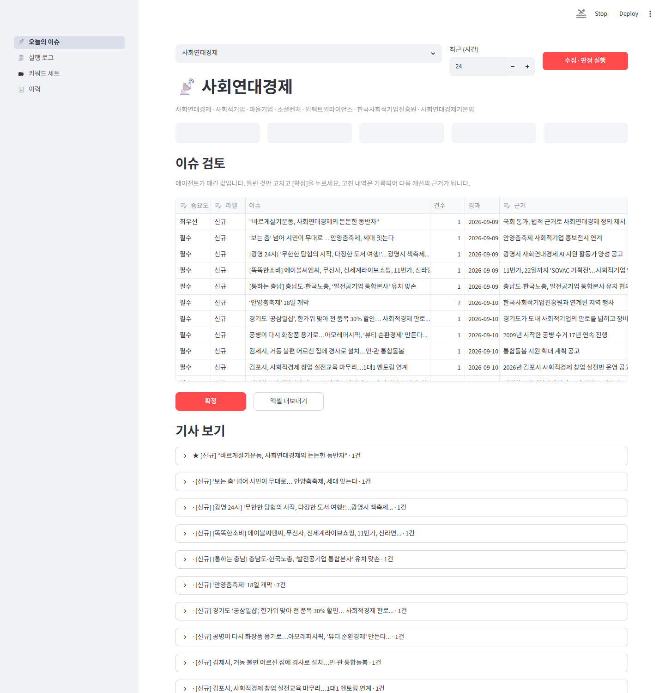
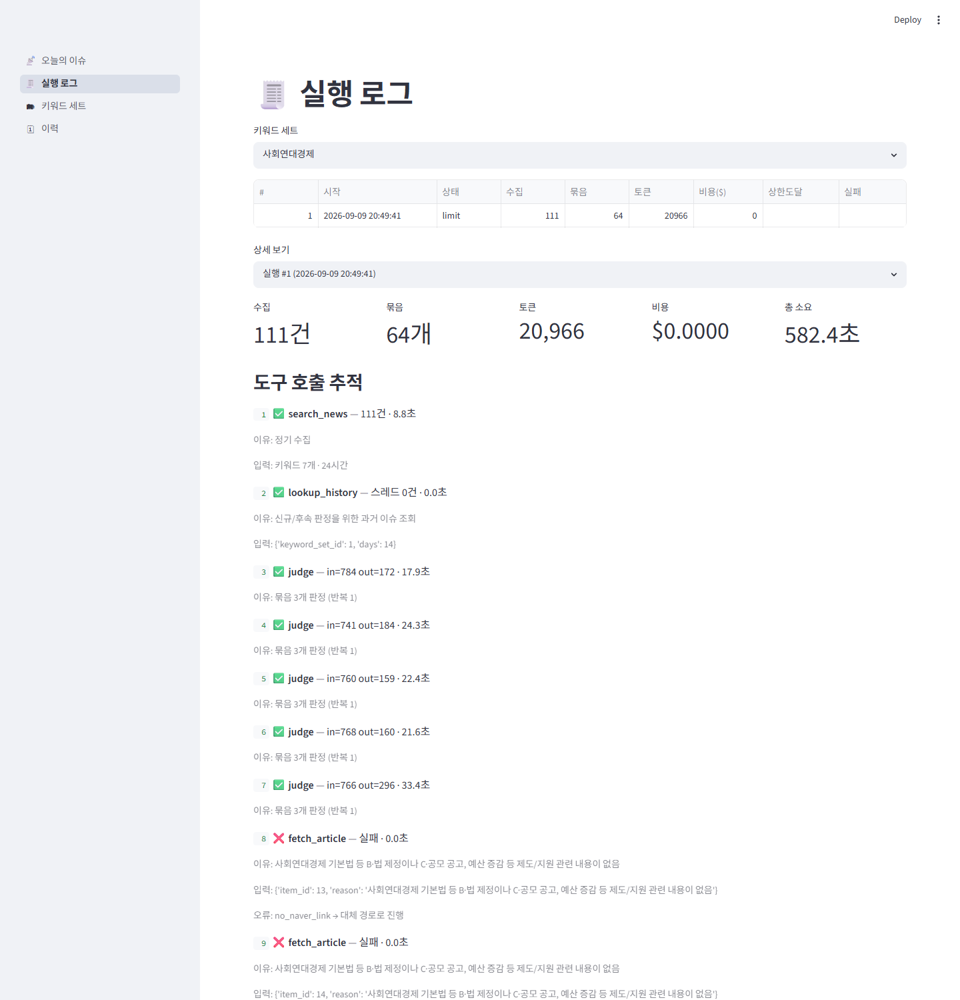
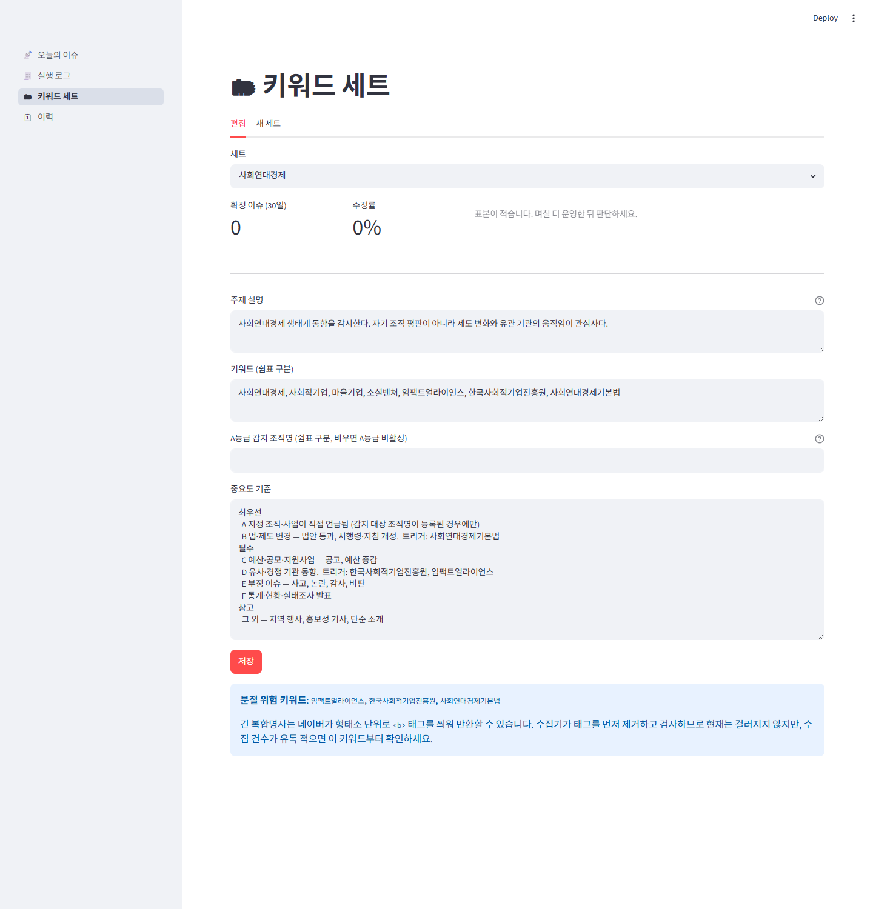
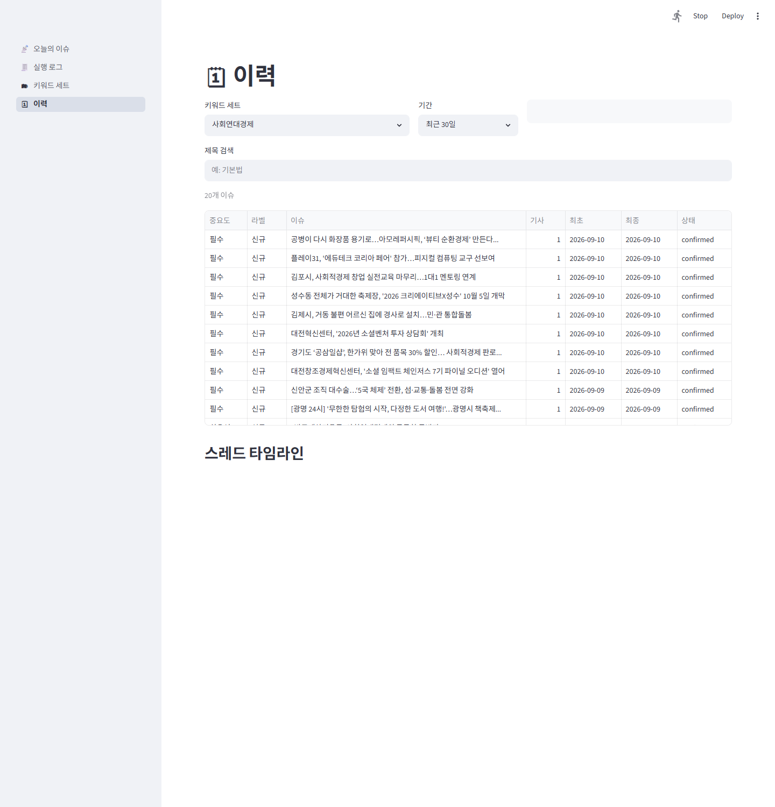

# 이슈 레이더 (Issue Radar)

키워드 기반 뉴스 모니터링 에이전틱 워크플로. 기사 100건을 이슈 20묶음으로 접고, 각 묶음에 `신규/후속/기존` 라벨과 중요도와 판단 근거를 붙여 사람이 검토·승인한다.

> **설계 제1원칙 — 에이전트는 기사를 지우지 않는다. 묶고, 접고, 라벨을 붙일 뿐이다.**
> 중요도가 낮게 매겨져도 목록에서 사라지지 않는다. 순서가 뒤로 갈 뿐이다.
> 라벨을 믿지 못하면 전부 펼쳐서 기존 방식과 동일하게 훑을 수 있다.

기획 문서는 [`PRD.md`](PRD.md)에 있다.

---

## 왜 만들었나

매일 키워드로 뉴스를 검색해 엑셀 100줄을 눈으로 훑으며 "새 이슈인가 / 어제 그건가 / 후속보도인가"를 판단하는 업무가 있었다. AI에 맡기면 중요한 기사를 조용히 빠뜨릴까 봐 미뤄왔다.

그런데 기존 수집 스크립트를 검토하니 **이미 두 군데에서 조용한 누락이 있었다.**

```python
# 결함 1  display=100 고정, start 페이징 없음 → 키워드당 100건에서 잘림
url = f"...&display=100&sort=date"

# 결함 2  태그 제거 '전에' 키워드 재확인
if term in item['title'] or term in item['description']:
```

네이버는 검색어를 `<b>` 태그로 감싸 반환하고, 형태소 단위로 쪼개 감싸는 경우가 있다.

```
응답:  <b>한국</b><b>사회적기업</b><b>진흥원</b>이 발표한...
검사:  "한국사회적기업진흥원" in "<b>한국</b>..."  →  False  →  폐기 (로그도 오류도 없음)
```

그래서 순서를 이렇게 잡았다. **수집 재현율을 먼저 확보하고, 그 위에 판단 계층을 얹는다.**

### 실측 결과 (2026-09-09, 최근 24시간)

```
기존 110건 → 수정 후 187건   (77건 회복, +70%)
```

| 키워드 | 기존 | 수정 후 | 회복 |
|---|---|---|---|
| 사회적기업 | 40 | 86 | **+46** |
| 사회연대경제 | 23 | 43 | **+20** |
| 마을기업 | 15 | 26 | **+11** |
| 사회연대경제기본법 · 한국사회적기업진흥원 · 임팩트얼라이언스 | — | — | 0 |

**유실의 원인은 전부 결함 1(페이징)이었다.** 하루치 검색만으로도 흔한 키워드가 100건 천장에 걸려 70%를 잃고 있었다.

**결함 2(태그 분절)로 인한 유실은 0건이었다.** 설계 단계에서 긴 복합명사가 형태소 분절로 폐기될 것이라 예측했으나 실측으로 반증됐다 — 이 키워드들은 하루 1~24건이라 애초에 천장에 닿지 않았다. 태그·엔티티 처리는 비용이 0이고 발생 시 조용히 유실되는 실패를 막으므로 그대로 유지한다.

`python eval/run_eval.py collect` 로 재현할 수 있다.

---

## 설치

```bash
pip install -r requirements.txt
```

Python 3.11+ / [Ollama](https://ollama.com) 필요.

```bash
ollama pull qwen3:4b
```

`qwen3.5:2b`와 비교 실험한 결과 4b가 등급 변별력·지시 준수·속도 모두에서 나았다. 아래 [모델 비교](#판정-품질--모델-비교로-해소) 참조.

### 환경변수

```bash
cp .env.example .env
```

| 변수 | 설명 |
|---|---|
| `NAVER_CLIENT_ID` / `NAVER_CLIENT_SECRET` | [네이버 개발자센터](https://developers.naver.com/apps)에서 발급 |
| `OLLAMA_URL` | 기본 `http://localhost:11434` |
| `OLLAMA_MODEL` | 기본 `qwen3:4b` |

`.env`는 `.gitignore`에 있다. 커밋하지 말 것.

---

## 실행

```bash
python main.py --init                        # 기본 키워드 세트 생성 (최초 1회)
python main.py --hours 48                    # 첫 실행은 48시간 권장
python main.py --hours 24                    # 이후 매일
streamlit run app.py                         # 화면
```

| 명령 | 설명 |
|---|---|
| `python main.py --init` | 기본 세트 생성 |
| `python main.py --set <이름> --hours 24` | 수집 + 판정 |
| `python main.py --resume <RUN_ID>` | 중단된 실행 이어서 |
| `python main.py --list` | 세트와 최근 실행 |

DB가 이력을 기억하므로 **첫 실행만 넓게(48시간) 긁고 이후엔 24시간이면 충분하다.**

---

## 화면

아래는 전부 **실제 실행 결과**다 (2026-09-10, 키워드 7개 / 최근 24시간 / 76건 수집 → 63묶음).

### ① 오늘의 이슈 — 메인이자 승인 지점



76건이 63묶음으로 접혔다. 라벨·중요도·근거가 이미 채워진 상태로 나오고, 사람은 틀린 것만 드롭다운으로 고친 뒤 [확정]을 누른다. 상단에 수집 건수·묶음 수·토큰·비용·상태가 함께 뜬다.

### ② 실행 로그 — 관찰 가능성



**어떤 도구를 왜 불렀고 무엇을 받았는지**가 전부 남는다. 위 캡처에서 확인할 수 있는 것:

- `search_news` → `lookup_history` → `judge` 배치 반복
- 배치마다 입출력 토큰과 소요시간
- `fetch_article` **실패**와 그 처리 — 이유가 기록되고 `no_naver_link → 대체 경로로 진행`
- 단계별 소요시간과 병목

### ③ 키워드 세트 — 기준 관리와 수정률



세트마다 키워드·주제 설명·A~F 중요도 기준을 따로 갖는다. 상단 지표 셋이 핵심이다.

| 지표 | 세는 것 |
|---|---|
| **수정률** | 확정할 때 라벨이나 중요도를 하나라도 고친 비율 |
| **누락률** | 그중 사람이 등급을 **올린** 것만 — 놓칠 뻔한 건 |
| 과잉 | 사람이 등급을 **내린** 건수 — 귀찮을 뿐 안전한 실수 |

누락률이 10%를 넘으면 기준 점검을 권고한다.

### ④ 이력 — 스레드 타임라인



과거 이슈를 기간·중요도로 되짚어본다. 에이전트 원안과 사람 확정값이 다르면 그 사실도 표시된다.

<details>
<summary>캡처 다시 만들기</summary>

```bash
python -m pip install playwright          # 시스템 Chrome을 쓰므로 브라우저 다운로드 불필요
streamlit run app.py --server.port 8603
python docs/capture.py http://localhost:8603
```

문서용 도구이므로 `requirements.txt`에는 넣지 않는다.
</details>

### 승인이 형식적이지 않은 이유

1. **확정 라벨이 내일의 판단 기준이 된다.** 오늘 확정한 스레드가 내일 `lookup_history`의 조회 대상이다. 잘못된 판정을 방치하면 다음날 판단이 연쇄로 틀어진다.
2. **수정 이력이 곧 실패 사례 데이터다.** "에이전트는 참고, 사람은 최우선"이 기록되어 어디서 틀리는지가 쌓인다.

수정률이 20%를 넘으면 ③ 화면이 기준 점검을 권고한다. 재검토 시점을 기억할 필요 없이 숫자가 알려준다.

---

## 구조

```
main.py              CLI — 스케줄러·n8n이 붙는 지점
app.py               Streamlit 라우터
views/               화면 4개 (로직 없음)
core/
  collect.py         네이버 수집 — 페이징 · 태그버그 · 엔티티 · 날짜 · 중복
  cluster.py         규칙 클러스터링 + 라벨 판정
  agent.py           에이전트 루프 + 종료 조건 + 재개
  tools.py           도구 4개 + 실패 처리
  llm.py             Ollama 호출 (모델 교체 지점)
  db.py              SQLite — 쓰기의 유일한 경로
eval/run_eval.py     세팅별 비교 실험
```

### 에이전트 루프

```
[코드]  네이버 수집 (페이징·태그·엔티티·중복)
[코드]  제목 유사도로 묶기                    76건 → 63묶음
[코드]  과거 이슈 조회
[코드]  신규 / 후속 / 기존 라벨 판정

  ┌──────────────────────────────────────┐
  │  ← 에이전트가 맡는 구간               │
  │                                      │
  │  ① 이 묶음이 A~F 중 무엇에 해당하나   │
  │  ② 왜 그렇게 봤나 (근거)              │
  │  ③ 제목·요약만으로 판단이 되나        │
  │       안 되면 → 본문 요청             │
  │  ④ 본문을 받아 다시 판정              │
  └──────────────────────────────────────┘

[코드]  항목 → 등급 매핑 (A·B→최우선, C~F→필수, none→참고)
[코드]  법령명이 기사 원문에 있는지 검증 → 없으면 강등
[코드]  결과 표시
[사람]  승인
```

③④가 "결과 관찰 → 다음 행동 결정"이다. 종료 조건은 **묶음당 반복 3회 / 본문 조회 3건 / 30분 / 50,000 토큰**. 상한 도달은 실패가 아니라 기록되는 상태이며, 미판정 묶음도 `보류` 표시로 목록에 남고 `--resume`으로 이어진다.

### 에이전트의 역할이 좁은 이유

**처음에는 더 많이 맡겼다가, 틀리는 것을 확인할 때마다 코드로 옮겼다.**

| 원래 에이전트가 하던 것 | 실측 | 어디로 갔나 |
|---|---|---|
| 신규/후속/기존 라벨 | **5건 중 1건** 정답 | 코드 — 제목 유사도 |
| 등급 직접 선택 | 전부 `필수`(2b) / 전부 `B`(4b)로 몰림 | 코드 — 항목→등급 매핑 |
| "법이 바뀌었다" 주장 | **9건 전부** 근거 법령 없음 | 코드 — 기사 원문 대조 |
| 배치 안에서 항목 식별 | 근거가 한 칸씩 밀려 붙음 | 코드 — 제목으로 재정렬 |

원칙은 하나다.

> **비교하면 되는 일은 코드가, 해석해야 하는 일은 에이전트가.**

제목이 비슷한지는 계산이지 판단이 아니다. 반면 "이 기사가 공모 공고인가 그냥 행사인가"는 도메인 맥락을 읽어야 하는 일이다.

**작은 모델일수록 자유도를 줄여야 맞춘다.** 등급을 직접 고르게 했을 때는 한쪽으로 몰렸지만, 항목만 고르게 하고 매핑을 코드가 하자 분포가 살아났다. 같은 처방을 네 번 반복한 셈이다.

정직하게 말하면 이것은 "도구를 스스로 골라 쓰는 자율 에이전트"가 아니라 **판단 지점이 정해진 에이전트**다. 로컬 4B 모델에는 그 편이 맞았다 — 등급 하나 고르는 것조차 자유도를 줄여야 맞췄기 때문이다.

### 도구 4개

| 도구 | 권한 | 실패 시 |
|---|---|---|
| `search_news` | 읽기 | 키워드 단위 격리, 상한은 경고로 기록 |
| `lookup_history` | **읽기 전용** | **즉시 중단** — 이력 없이 판정하면 전건이 `신규`로 오염된다 |
| `fetch_article` | 읽기 | 재시도 없음 → `description`으로 판정하고 진행 |
| `export_excel` | 쓰기 | **승인 이후에만** 호출 가능 |

에이전트에게 노출되는 DB 도구는 읽기 전용이다. 쓰기는 사람의 승인이 트리거한다.

**판정 호출이 죽어도 실행 전체는 죽지 않는다.** Ollama가 콜드 스타트 중이면 `/api/tags`에는 응답하면서 요청은 거절하는 구간이 있다(모델 로딩 약 10초). 실제로 그 구간에서 실패했다. 지금은 3회까지 재시도하고, 그래도 안 되면 **그 배치만 미판정으로 남긴 뒤 다음 배치로 넘어간다.** 30분짜리 실행이 순간적인 오류로 통째로 날아가지 않는다.

---

## 평가

```bash
python eval/run_eval.py collect      # (가) 수집 재현율 — 키워드별. 가장 먼저 돌린다
python eval/run_eval.py cluster      # (라) 클러스터 임계값 스윕 (API 불필요)
python eval/run_eval.py prompt       # (다) 중요도 기준 유무
python eval/run_eval.py model --models qwen3.5:2b,qwen3:4b   # (나) 모델 비교
```

| 지표 | 정의 |
|---|---|
| **누락률** | 사람이 최우선·필수로 본 이슈 중 에이전트가 참고로 내린 비율 |
| **수정률** | 승인 시 사람이 라벨·중요도를 고친 비율 (③ 화면에서 상시 계측) |
| 묶음 정확도 | 잘못 묶인 / 잘못 나뉜 비율 |
| 소요·토큰·비용 | ② 화면에 단계별로 기록 |

### 사전 측정 결과

구현 전에 가장 위험한 가정부터 확인했다 (PRD §9.7).

| 설정 | 소요 | 출력 토큰 | `content` |
|---|---|---|---|
| thinking 기본값 | **569초** | 4,061 | **빈 문자열** |
| **`think: False`** | **6.9초** | 23 | 유효한 JSON |

`qwen3.5`는 thinking 모델이고 Ollama에서 기본 활성이다. `core/llm.py`에 `think=False`가 못 박혀 있고 회귀 테스트가 지킨다.

같은 측정에서 **라벨 정확도가 5건 중 1건**으로 무너졌고, 배치 뒤쪽 항목은 입력 문장을 그대로 복사해 근거로 반환했다. 그래서 라벨 판정을 LLM에서 코드로 옮기고 배치를 5에서 3으로 줄였다.

---

## 테스트

```bash
pytest tests/ -v
```

60개. 핵심은 이 프로젝트의 출발점이 되는 주장을 고정한 것이다.

```python
raw = "<b>한국</b><b>사회적기업</b><b>진흥원</b>이 발표한..."
assert "한국사회적기업진흥원" not in raw            # 기존 코드가 폐기하던 조건
assert "한국사회적기업진흥원" in collect.clean(raw)  # 수정 후에는 걸린다
```

Ollama가 실행 중이 아니면 통합 테스트 1개는 자동으로 건너뛴다.

---

## 확장

이 시스템의 이음매는 **수집 · 판단 · 발송** 세 곳뿐이다. 대부분의 확장은 그중 한 곳에 모듈 하나를 추가하는 일로 끝난다.

| 확장 | 방법 |
|---|---|
| **자동 실행** | **구현됨** — 아래 참조 |
| 게시판 감시 (채용·사업공고) | `core/collect_board.py` + `views/5_게시판_감시.py` 추가, `item.source`에 `board_*` |
| n8n 연동 | Execute Command 노드로 CLI 호출 + 슬랙·메일 발송 |
| 다른 모델 | `.env`의 `OLLAMA_MODEL` 변경, 또는 `core/llm.py`의 `judge()` 교체 |

### 자동 실행 (사람이 시작하지 않아도 도는 워크플로)

```bash
scripts
egister_task.bat          # 매일 08:00 자동 실행 등록
```

| 명령 | 하는 일 |
|---|---|
| `scripts
egister_task.bat` | Windows 작업 스케줄러에 등록 |
| `schtasks /run /tn "IssueRadar"` | 지금 한 번 돌려보기 |
| `schtasks /query /tn "IssueRadar" /v /fo list` | 등록 상태 확인 |
| `schtasks /delete /tn "IssueRadar" /f` | 해제 |

`scripts\daily.bat`이 실제 진입점이다. Ollama를 먼저 깨우고, 결과를 `data/cron.log`에 누적한다 — **스케줄러는 실패해도 조용하므로 로그가 유일한 확인 수단이다.**

아침에 출근하면 판정이 끝나 있고, 사람은 `streamlit run app.py`로 검토·승인만 하면 된다.

**확장을 위한 사전 코드는 두지 않는다.** 구현체가 하나뿐인 인터페이스는 두 번째가 왔을 때 거의 맞지 않아 다시 짜게 된다. 이 설계가 확장 가능한 이유는 확장 지점을 만들어둬서가 아니라 층이 분리되어 있어서다.

유일한 예외가 `item.source` 컬럼 하나다. 데이터 스키마만은 나중에 바꾸는 비용이 크다.

### 게시판을 붙일 때

1. 크롤링 전에 RSS·오픈API·공공데이터포털을 먼저 확인한다. HTML 파싱은 사이트 개편 시 조용히 멈춘다
2. 수집 0건이 "새 글 없음"인지 "스크래퍼 고장"인지 구분되어야 한다
3. 공고는 마감이 있어 뉴스와 시급성이 다르다

---

## 현재 상태

| 항목 | 상태 | 근거 |
|---|---|---|
| 수집 (110→187건, +70%) | ✅ | `eval/run_eval.py collect` |
| 클러스터링 (111건→64묶음) | ✅ | `eval/run_eval.py cluster` |
| 에이전트 루프·종료조건·재개 | ✅ | 테스트 60개 |
| 관찰 가능성 (trace·토큰·비용) | ✅ | ② 실행 로그 화면 |
| 승인·수정률 계측 | ✅ | ① ③ 화면 |
| 중요도 판정 품질 | ⚠️ | 모델 교체 + 구조적 검증으로 개선, 정확도는 미검증 |
| 자동 실행 트리거 | ✅ | `scripts/register_task.bat` |

### 수용 기준 점검 (2026-09-10)

| # | 기준 | 판정 |
|---|---|---|
| 1 | README 절차만으로 새 환경 실행 | 부분 (이 환경에서만 검증) |
| 2 | 사람 개입 없이 판정 완료 | 부분 (1일치 63묶음 전건 완료, 7일 표본 미확보) |
| 3 | **누락률 10% 이하** | **통과 — 7.9%** (63건 확정) |
| 4 | 수집 재현율 개선 확인 | **통과** (+70%) |
| 5 | 도구 호출 이유·결과·시간 기록 | **통과** (23단계 전부) |
| 6 | 중단 후 재개 | **통과** (`--resume`으로 20묶음 마저 판정) |
| 7 | 검토 시간 단축 | **부분** (정성 확인) |

통과 4 / 부분 3 / 미측정 0. 상세는 PRD §10.1.

### 누락률 측정 결과 (1일치 63묶음)

```
수정률  14.3%      누락률  7.9% (5건)      과잉  4건
```

**누락 5건** — 새마을금고 1.1조 특례보증대출, 지방세제 개편 기고, 사회연대경제박람회 2건, 소셜벤처 투자 상담회.

**과잉 4건은 전부 `D` 오판**이었고, 그중 하나는 기사에 없는 기관명을 지어낸 환각이었다(영월 템플스테이 → "임팩트얼라이언스 협력").

놓치는 것이 0이 된 게 아니라 **놓치는 것이 보이게 됐다.** 기존 방식은 페이징에서 조용히 잘려 누락 자체를 알 수 없었다. 상세는 PRD §10.2.

### 검토 시간 — 절약되는 건 검토 시간만이 아니다

63묶음을 직접 검토한 사용자 확인 (초시계 측정은 아님):

> 훑을 때보다는 빨랐음. **다른 일을 할 수 있으니.**

| | 기존 | 지금 |
|---|---|---|
| 검토 | 엑셀 100줄 이상을 처음부터 | 63묶음이 등급순으로 정렬된 상태 |
| 처리 | 사람이 붙어 있어야 함 | **약 30분 무인 실행 — 그 시간에 다른 일** |

자동 실행 트리거를 붙이면 이 30분마저 출근 전으로 옮겨간다. 상세는 PRD §10.3.

### 판정 품질 — 모델 비교로 해소

`qwen3.5:2b`는 등급을 매기지 못했다. 최우선을 한 건도 내지 않고 절반을 `필수`로 몰아 정렬이 의미를 잃었고, 없는 사실을 근거로 지어냈다("2030 청년 제주살이하며 농촌 체험" → "B·법·제도 변경"). 프롬프트를 두 차례 고쳤으나 오류가 A등급에서 C등급으로 자리를 옮겼을 뿐이었다.

그래서 모델을 바꿔 비교했다. **같은 기사, 빈 이력, 모델만 다름** (77건 → 59묶음):

| 세팅 | 판정 | 미판정 | 소요 | 최우선 | 필수 | 참고 | 근거 길이 |
|---|---|---|---|---|---|---|---|
| qwen3.5:2b | 57 | 2 | 943초 | **0** | 30 (51%) | 27 | 34자 |
| **qwen3:4b** | **59** | **0** | **861초** | **10** | 10 (17%) | 39 | **14자** |

**큰 모델이 더 빨랐다.** 토큰당 생성 속도는 4b가 느린데(3.7 vs 5.3 tok/s), 근거를 25자 지시대로 짧게 써서 생성 토큰이 적었고 총 소요가 뒤집혔다. 지시를 지키는 것이 속도로 돌아온 셈이다.

> 본 실험 전 묶음 2건으로 예비 측정했을 때는 "4b가 2.4배 느리고 지시를 더 못 지킨다"는 정반대 결론이 나왔다. 2건 표본으로 모델을 판단하면 안 된다.

```bash
python eval/run_eval.py model --models qwen3.5:2b,qwen3:4b --seconds 3600
```

### 그런데 분포 개선은 정확도 개선이 아니었다

4b가 최우선으로 올린 9건을 열어보니 **거의 전부 오판**이었다.

| 기사 | 근거 | 실제 |
|---|---|---|
| 11번가, '사회적가치 페스타' 동참 | "B·법·제도 변경" | 기업 행사 |
| 충남도-한국노총 유치 맞손 | "B·법·제도 변경" | 업무협약 |
| 신안군 조직 대수술 | "B·법 제정" | 조직 개편 |
| 초고령사회의 '늪' | "B·법 제정" | 분석 칼럼 |

**9건 전부 근거가 "B·법 제정"이었고, 법이 실제로 제정된 기사는 없었다.** 2b가 전부 `필수`로 몰았다면 4b는 전부 `B`로 몰았다. 문제가 해결된 게 아니라 자리를 옮겼다.

지표만 보면 개선처럼 보였다는 점이 중요하다. **사람이 열어보지 않으면 알 수 없는 종류의 실패**다.

### 대응 — 등급을 모델에게 맡기지 않는다

| | 이전 | 이후 |
|---|---|---|
| 모델이 답하는 것 | `importance` (최우선/필수/참고) | `code` (A~F/none) 와 `law` |
| 등급 결정 | 모델 | **코드가 매핑** (`CODE_GRADE`) |
| B 주장 검증 | 없음 | **`law`가 비면 자동 강등** |

기준의 B 정의도 좁히고 부정 예시를 넣었다(정책 논의·조직 개편·MOU·의원 발언·칼럼은 B가 아니다).

같은 9건 재판정 결과: **최우선 9 → 3 (기준 구체화) → 1 (구조 변경)**

**지시로 안 되는 것은 구조로 막는다.** 라벨 판정을 규칙으로 옮긴 것과 같은 처방이고, 같은 이유로 작동했다 — 작은 모델은 자유도가 줄수록 덜 흔들린다.

**여전히 미검증** — 마지막 1건도 옳은지는 모른다. 정확도는 사람이 라벨링해 누락률을 내야 확인된다.

## 알려진 한계

- **CPU 추론이 느리다.** GPU 없는 환경(Ryzen 7 PRO 4750U)에서 59묶음 판정에 약 14분. 규칙 클러스터링이 LLM 입력을 크게 줄여 이 정도가 나온다. 매일 한 번 도는 배경 작업을 전제한다
- **본문 조회는 네이버 뉴스 링크만 지원한다.** 언론사 원문은 구조가 제각각이라 시도하지 않고 `description`으로 판정한다
- **검색 자체의 노이즈가 남는다.** 네이버 형태소 검색이 무관한 기사를 반환하고, 재확인을 통과한 것 중에도 관련 없는 건이 섞인다
